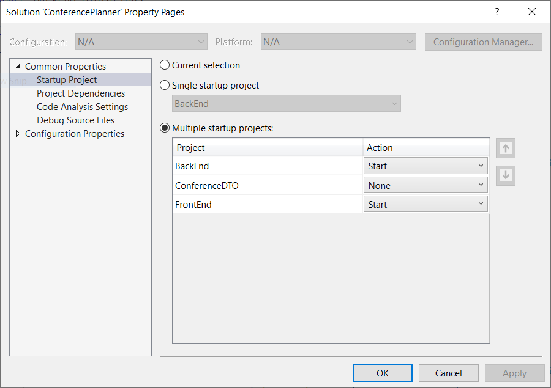

# Workshop2019

## What you'll be building

In this workshop, we'll start with sample ASP.NET Core application. This application comprises of an API-backend, a web front-end application, and a common library for shared data transfer objects.

However, this application is riddled with anti-patterns that prevent this application from scaling well. Due course of this workshop, we'll attempt to fix some of the issue with the application.

## Getting started

To begin with let's ensure we cloning and trying the build the starting point of the project. Start by navigating to the `./lab` directory and building the solution

```powershell
git clone https://github.com/shirhatti/ReadyWorkshop2019.git
cd .\ReadyWorkshop2019\lab\
dotnet build
```

At this point you should able to successfully launch Visual Studio

```powershell
.\ConferencePlanner.sln
```

If everything is looking good so far, navigate to the Backend project and run the following commands in the command prompt to setup your database correctly

```powershell
cd .\ReadyWorkshop2019\lab\BackEnd
dotnet ef migrations add Initial
dotnet ef database update
```

### Seed the database
// TODO

### Change startup project

Change the startup project to launch both the FrontEnd and the BackEnd

